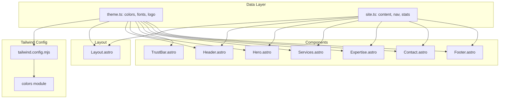

# Refactoring Plan: Reusable Small-Business Website Template

## Executive Summary

Transform this Astro + TypeScript website into a reusable template where a developer only needs to edit two files for a complete rebrand:
- `src/data/site.ts` — all content/text/links
- `src/data/theme.ts` — all visual design tokens

## Current State Analysis

### Already Externalized (No Changes Needed)
- `src/data/site.ts` — contains site name, legal name, tagline, description, domain, nav items, trust stats, certs, track record, credibility

### Requires Externalization

| File | Hardcoded Values |
|------|------------------|
| [`src/layouts/Layout.astro`](src/layouts/Layout.astro:79) | Font CDN URL (`https://fonts.googleapis.com/css2?family=Inter:wght@400;500;600;700&display=swap`), og:image URL, body classes (`bg-slate-950 text-slate-100`) |
| [`src/components/Header.astro`](src/components/Header.astro:13) | Logo SVG stroke color (`#14b8a6` = teal-500) |
| [`src/components/Hero.astro`](src/components/Hero.astro:21) | Subheadline text, CTA labels ("Schedule a Consultation", "View Services"), eyebrow text |
| [`src/components/TrustBar.astro`](src/components/TrustBar.astro:19) | Icon color (`text-teal-500`) |
| [`src/components/Services.astro`](src/components/Services.astro:29) | Section description text |
| [`src/components/Expertise.astro`](src/components/Expertise.astro:10) | Section title ("Deep Expertise, Proven Results"), training bullets, technical foundation text |
| [`src/components/Contact.astro`](src/components/Contact.astro:10) | Section title ("Discuss a Pilot"), description text, button text |
| [`src/components/Footer.astro`](src/components/Footer.astro:15) | Company type subtitle ("Enterprise Technology Consulting") |
| [`src/content/config.ts`](src/content/config.ts:8) | Icon enum (`z.enum(['ai', 'shield', 'cloud', 'fractional', 'assessment'])`) — brittle for new businesses |
| [`tailwind.config.mjs`](tailwind.config.mjs:10) | Defines `primary` and `accent` tokens but components ignore them, using raw `teal-*`/`slate-*` classes |

---

## Target: `src/data/theme.ts` (New File)

```typescript
// filepath: src/data/theme.ts
import type { Config } from 'tailwindcss';

// Tailwind v3 color palette names
export type ColorPalette = 
  | 'slate' | 'gray' | 'zinc' | 'neutral' | 'stone'
  | 'red' | 'orange' | 'amber' | 'yellow' | 'lime'
  | 'green' | 'emerald' | 'teal' | 'cyan' | 'sky'
  | 'blue' | 'indigo' | 'violet' | 'purple' | 'fuchsia'
  | 'pink' | 'rose';

export type BorderRadius = 'sharp' | 'soft' | 'pill';

export interface ThemeConfig {
  // Color palettes (Tailwind v3 names)
  primaryColor: ColorPalette;
  neutralColor: ColorPalette;
  
  // Typography
  fontFamily: string;
  fontCDNUrl: string;
  
  // Appearance
  darkMode: boolean;
  borderRadius: BorderRadius;
  
  // Logo (uses currentColor for stroke/fill)
  logoSVG: string;
}

export const theme: ThemeConfig = {
  primaryColor: 'teal',
  neutralColor: 'slate',
  fontFamily: 'Inter',
  fontCDNUrl: 'https://fonts.googleapis.com/css2?family=Inter:wght@400;500;600;700&display=swap',
  darkMode: true,
  borderRadius: 'soft',
  logoSVG: `<svg width="32" height="32" viewBox="0 0 32 32" fill="none" aria-hidden="true">
  <path d="M6 8 L16 16 L6 24" stroke="currentColor" stroke-width="3" stroke-linecap="round" stroke-linejoin="round"/>
  <path d="M14 8 L24 16 L14 24" stroke="currentColor" stroke-width="3" stroke-linecap="round" stroke-linejoin="round" opacity="0.6"/>
</svg>`,
} as const;
```

### Key Design Decisions

1. **`currentColor` for logo** — The logo SVG uses `currentColor` instead of hardcoded `#14b8a6`, allowing it to inherit the text color from context.

2. **Color palette names, not hex values** — We store palette names (`'teal'`, `'slate'`) rather than hex codes because Tailwind v3 cannot purge dynamic strings like `${color}-500`.

3. **Border radius enum** — Three presets: `sharp` (0), `soft` (0.5rem/rounded-lg), `pill` (9999px/rounded-full).

---

## Target: New Fields for `src/data/site.ts`

Add these fields to the existing `site` object:

| Field Name | TypeScript Type | Current Hardcoded Value | Source File |
|------------|-----------------|------------------------|-------------|
| `heroEyebrow` | `string` | `{site.legalName}` | [`Hero.astro:10`](src/components/Hero.astro:10) |
| `heroCopy` | `string` | "Strategic AI guidance, battle-tested security expertise..." | [`Hero.astro:21`](src/components/Hero.astro:21) |
| `heroPrimaryCTA` | `string` | "Schedule a Consultation" | [`Hero.astro:31`](src/components/Hero.astro:31) |
| `heroSecondaryCTA` | `string` | "View Services" | [`Hero.astro:37`](src/components/Hero.astro:37) |
| `servicesDescription` | `string` | "Strategic technology leadership for companies at critical inflection points." | [`Services.astro:29`](src/components/Services.astro:29) |
| `expertiseTitle` | `string` | "Deep Expertise, Proven Results" | [`Expertise.astro:10`](src/components/Expertise.astro:10) |
| `recentTraining` | `string[]` | ["AI Strategy & Governance - Ongoing education...", "Prompt Engineering & LLM Best Practices..."] | [`Expertise.astro:44-50`](src/components/Expertise.astro:44) |
| `technicalFoundation` | `string` | "Strong engineering backgrounds across the team with degrees in Computer Science and Engineering" | [`Expertise.astro:59`](src/components/Expertise.astro:59) |
| `contactTitle` | `string` | "Discuss a Pilot" | [`Contact.astro:10`](src/components/Contact.astro:10) |
| `contactDescription` | `string` | "Book a 30-minute consult to explore how AI enablement under compliance constraints can accelerate your business objectives." | [`Contact.astro:13`](src/components/Contact.astro:13) |
| `calLink` | `string` | (not currently used — add for cal.com integration) | — |
| `companyType` | `string` | "Enterprise Technology Consulting" | [`Footer.astro:15`](src/components/Footer.astro:15) |
| `ogImage` | `string` | `${site.canonicalURL}/og-image.jpg` | [`Layout.astro:63`](src/layouts/Layout.astro:63) |

---

## Tailwind Config Strategy: Static Color Lookup

### Problem
Tailwind v3's JIT compiler cannot analyze dynamic strings like `colors[theme.primaryColor][500]`. The purge scanner looks for literal class names.

### Solution: Static Lookup with `tailwindcss/colors`

```javascript
// tailwind.config.mjs
import colors from 'tailwindcss/colors';
import { theme } from './src/data/theme.ts';

/** @type {import('tailwindcss').Config} */
export default {
  content: ['./src/**/*.{astro,html,js,jsx,md,mdx,svelte,ts,tsx,vue}'],
  theme: {
    extend: {
      fontFamily: {
        sans: [theme.fontFamily, ...],
      },
      colors: {
        // Static lookup — Tailwind can analyze these
        primary: {
          400: colors[theme.primaryColor][400],
          500: colors[theme.primaryColor][500],
          600: colors[theme.primaryColor][600],
        },
        neutral: {
          50: colors[theme.neutralColor][50],
          100: colors[theme.neutralColor][100],
          // ... etc for all needed shades
        },
      },
      borderRadius: {
        DEFAULT: theme.borderRadius === 'sharp' ? '0' : theme.borderRadius === 'soft' ? '0.5rem' : '9999px',
      },
    },
  },
  plugins: [],
};
```

### Why This Works
- By importing `theme` at the top level of `tailwind.config.mjs`, the color values are baked into the config at build time.
- Tailwind's purge scanner sees literal class names like `text-primary-500` in the source files.
- No runtime theme switching — fully static.

---

## Content Schema: Remove Brittle Icon Enum

### Current (Brittle)
```typescript
// src/content/config.ts
icon: z.enum(['ai', 'shield', 'cloud', 'fractional 'assessment']),
```

### Target (Flexible)
```typescript
// src/content/config.ts
icon: z.string(), // Allow any icon name from Heroicons
```

The icon rendering will use a fallback icon map in components rather than enforcing a closed set.

---

## Implementation Order

1. **Create `src/data/theme.ts`** — Define the theme config structure
2. **Update `tailwind.config.mjs`** — Add static color lookup using `tailwindcss/colors`
3. **Add new fields to `src/data/site.ts`** — Content fields listed above
4. **Update `src/layouts/Layout.astro`** — Import theme, use `theme.fontCDNUrl`, `theme.darkMode`, `theme.logoSVG`
5. **Update `src/components/Header.astro`** — Use `theme.logoSVG` with `currentColor`
6. **Update `src/components/Hero.astro`** — Use site fields for copy and CTAs
7. **Update `src/components/TrustBar.astro`** — Use `primary` color token
8. **Update `src/components/Services.astro`** — Use `site.servicesDescription`
9. **Update `src/components/Expertise.astro`** — Use `site.expertiseTitle`, `site.recentTraining`, `site.technicalFoundation`
10. **Update `src/components/Contact.astro`** — Use `site.contactTitle`, `site.contactDescription`
11. **Update `src/components/Footer.astro`** — Use `site.companyType`
12. **Update `src/content/config.ts`** — Change icon to `z.string()`
13. **Update all `.astro` components** — Replace hardcoded `teal-*`/`slate-*` classes with `primary-*`/`neutral-*` tokens

---

## Mermaid: Component Data Flow



---

## Files to Modify

| File | Action |
|------|--------|
| `src/data/theme.ts` | **Create** — Theme configuration |
| `tailwind.config.mjs` | **Modify** — Add static color lookup |
| `src/data/site.ts` | **Modify** — Add new content fields |
| `src/layouts/Layout.astro` | **Modify** — Use theme tokens |
| `src/components/Header.astro` | **Modify** — Use theme.logoSVG |
| `src/components/Hero.astro` | **Modify** — Use site fields |
| `src/components/TrustBar.astro` | **Modify** — Use primary color |
| `src/components/Services.astro` | **Modify** — Use site.servicesDescription |
| `src/components/Expertise.astro` | **Modify** — Use site fields |
| `src/components/Contact.astro` | **Modify** — Use site fields |
| `src/components/Footer.astro` | **Modify** — Use site.companyType |
| `src/content/config.ts` | **Modify** — Change icon to z.string() |

---

## Success Criteria

After refactoring, a developer can rebrand the site by:

1. Editing `src/data/theme.ts`:
   - Change `primaryColor: 'teal'` → `'blue'`, `'indigo'`, etc.
   - Change `neutralColor: 'slate'` → `'gray'`, `'zinc'`, etc.
   - Change `fontFamily` and `fontCDNUrl` for different fonts
   - Toggle `darkMode: true/false`
   - Adjust `borderRadius`

2. Editing `src/data/site.ts`:
   - Update all text content, nav links, stats, etc.

**No component files (`.astro`) require edits for a standard rebrand.**